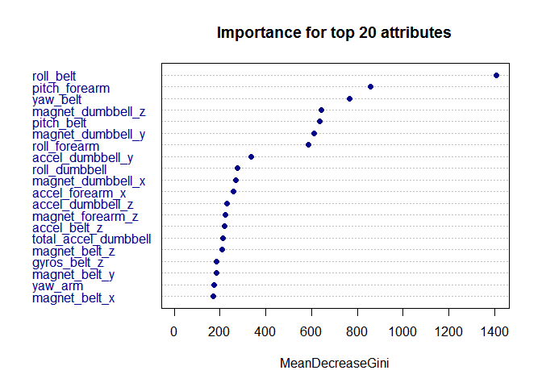
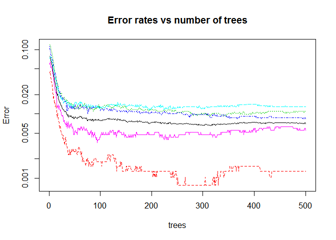

#  Predict the exercise pattern: Human Activity Recognition


Background
==========

Human Activity Recognition - HAR - has emerged as a key research area in the last years and is gaining increasing attention by the pervasive computing research community especially for the development of context-aware systems.
In this project analysis been performed to create a human activity prediction model based on data from accelerometers on the belt, forearm, arm, and dumbell of 6 participants while exercising. Incusitive reader can have more information from the website [here][1].

## Get and Clean data

### Load libraries and data


```r
library(caret)
library(doParallel)
# Load the data, the strings 'NA', 'NULL' and blank spaces to be seat as NA values
trainData <- read.csv('pml-training.csv', na.strings=c('', 'NA', 'NULL'))
testData <- read.csv('pml-testing.csv', na.strings=c('', 'NA', 'NULL'))
```

## Exploratory Data Analysis

### Find data dimension, names of the variables


```r
dim(trainData)
```

```
## [1] 19622   160
```

```r
names(trainData)
```

```
##   [1] "X"                        "user_name"               
##   [3] "raw_timestamp_part_1"     "raw_timestamp_part_2"    
##   [5] "cvtd_timestamp"           "new_window"              
##   [7] "num_window"               "roll_belt"               
##   [9] "pitch_belt"               "yaw_belt"                
##  [11] "total_accel_belt"         "kurtosis_roll_belt"      
##  [13] "kurtosis_picth_belt"      "kurtosis_yaw_belt"       
##  [15] "skewness_roll_belt"       "skewness_roll_belt.1"    
##  [17] "skewness_yaw_belt"        "max_roll_belt"           
##  [19] "max_picth_belt"           "max_yaw_belt"            
##  [21] "min_roll_belt"            "min_pitch_belt"          
##  [23] "min_yaw_belt"             "amplitude_roll_belt"     
##  [25] "amplitude_pitch_belt"     "amplitude_yaw_belt"      
##  [27] "var_total_accel_belt"     "avg_roll_belt"           
##  [29] "stddev_roll_belt"         "var_roll_belt"           
##  [31] "avg_pitch_belt"           "stddev_pitch_belt"       
##  [33] "var_pitch_belt"           "avg_yaw_belt"            
##  [35] "stddev_yaw_belt"          "var_yaw_belt"            
##  [37] "gyros_belt_x"             "gyros_belt_y"            
##  [39] "gyros_belt_z"             "accel_belt_x"            
##  [41] "accel_belt_y"             "accel_belt_z"            
##  [43] "magnet_belt_x"            "magnet_belt_y"           
##  [45] "magnet_belt_z"            "roll_arm"                
##  [47] "pitch_arm"                "yaw_arm"                 
##  [49] "total_accel_arm"          "var_accel_arm"           
##  [51] "avg_roll_arm"             "stddev_roll_arm"         
##  [53] "var_roll_arm"             "avg_pitch_arm"           
##  [55] "stddev_pitch_arm"         "var_pitch_arm"           
##  [57] "avg_yaw_arm"              "stddev_yaw_arm"          
##  [59] "var_yaw_arm"              "gyros_arm_x"             
##  [61] "gyros_arm_y"              "gyros_arm_z"             
##  [63] "accel_arm_x"              "accel_arm_y"             
##  [65] "accel_arm_z"              "magnet_arm_x"            
##  [67] "magnet_arm_y"             "magnet_arm_z"            
##  [69] "kurtosis_roll_arm"        "kurtosis_picth_arm"      
##  [71] "kurtosis_yaw_arm"         "skewness_roll_arm"       
##  [73] "skewness_pitch_arm"       "skewness_yaw_arm"        
##  [75] "max_roll_arm"             "max_picth_arm"           
##  [77] "max_yaw_arm"              "min_roll_arm"            
##  [79] "min_pitch_arm"            "min_yaw_arm"             
##  [81] "amplitude_roll_arm"       "amplitude_pitch_arm"     
##  [83] "amplitude_yaw_arm"        "roll_dumbbell"           
##  [85] "pitch_dumbbell"           "yaw_dumbbell"            
##  [87] "kurtosis_roll_dumbbell"   "kurtosis_picth_dumbbell" 
##  [89] "kurtosis_yaw_dumbbell"    "skewness_roll_dumbbell"  
##  [91] "skewness_pitch_dumbbell"  "skewness_yaw_dumbbell"   
##  [93] "max_roll_dumbbell"        "max_picth_dumbbell"      
##  [95] "max_yaw_dumbbell"         "min_roll_dumbbell"       
##  [97] "min_pitch_dumbbell"       "min_yaw_dumbbell"        
##  [99] "amplitude_roll_dumbbell"  "amplitude_pitch_dumbbell"
## [101] "amplitude_yaw_dumbbell"   "total_accel_dumbbell"    
## [103] "var_accel_dumbbell"       "avg_roll_dumbbell"       
## [105] "stddev_roll_dumbbell"     "var_roll_dumbbell"       
## [107] "avg_pitch_dumbbell"       "stddev_pitch_dumbbell"   
## [109] "var_pitch_dumbbell"       "avg_yaw_dumbbell"        
## [111] "stddev_yaw_dumbbell"      "var_yaw_dumbbell"        
## [113] "gyros_dumbbell_x"         "gyros_dumbbell_y"        
## [115] "gyros_dumbbell_z"         "accel_dumbbell_x"        
## [117] "accel_dumbbell_y"         "accel_dumbbell_z"        
## [119] "magnet_dumbbell_x"        "magnet_dumbbell_y"       
## [121] "magnet_dumbbell_z"        "roll_forearm"            
## [123] "pitch_forearm"            "yaw_forearm"             
## [125] "kurtosis_roll_forearm"    "kurtosis_picth_forearm"  
## [127] "kurtosis_yaw_forearm"     "skewness_roll_forearm"   
## [129] "skewness_pitch_forearm"   "skewness_yaw_forearm"    
## [131] "max_roll_forearm"         "max_picth_forearm"       
## [133] "max_yaw_forearm"          "min_roll_forearm"        
## [135] "min_pitch_forearm"        "min_yaw_forearm"         
## [137] "amplitude_roll_forearm"   "amplitude_pitch_forearm" 
## [139] "amplitude_yaw_forearm"    "total_accel_forearm"     
## [141] "var_accel_forearm"        "avg_roll_forearm"        
## [143] "stddev_roll_forearm"      "var_roll_forearm"        
## [145] "avg_pitch_forearm"        "stddev_pitch_forearm"    
## [147] "var_pitch_forearm"        "avg_yaw_forearm"         
## [149] "stddev_yaw_forearm"       "var_yaw_forearm"         
## [151] "gyros_forearm_x"          "gyros_forearm_y"         
## [153] "gyros_forearm_z"          "accel_forearm_x"         
## [155] "accel_forearm_y"          "accel_forearm_z"         
## [157] "magnet_forearm_x"         "magnet_forearm_y"        
## [159] "magnet_forearm_z"         "classe"
```

The data set has 19622 observations and 160 possible predictors. Looks like there is a lot of NAs. Let's check missing values and ranges.


Its quite self explanatory that there are lots of predictors that can be removed because of their missing values.

### Examining data types


```r
# Data type per column
sapply(trainData[1, ], class)

# Look for duplicated columns
duplicated(names(trainData))
```

### Indentify the type of activity

Indentify the type of activity and how the observations are distributed.


```r
unique(trainData$classe)
```

```
## [1] A B C D E
## Levels: A B C D E
```

```r
table(trainData$classe)
```

```
## 
##    A    B    C    D    E 
## 5580 3797 3422 3216 3607
```

## Data preprocessing

### Find and remove predictors with zero variance

```r
nsv <- nearZeroVar(trainData,saveMetrics=TRUE)
zeroVarPredictors <- nsv[nsv[,"zeroVar"] == TRUE,]

# Remove predictors with zero variance in both the train and the test sets
dropColumns <- names(trainData) %in% row.names(zeroVarPredictors)
trainData <- trainData[,!dropColumns]
testData <- testData[,!dropColumns]
```

After removing the zero variance predictors, the set has 154 possible predictors.

### Remove columns with missing values


```r
# Sum NAs per column
blankValues <- apply(trainData, 2, function(x) { sum(is.na(x)) })

# Remove columns with more than 50% of NAs
threshold <- nrow(trainData) * 0.5
trainData <- trainData[, which(blankValues < threshold)]
testData <- testData[, which(blankValues < threshold)]
```

As previously detected that there were lots of missing values, so we drop the predictors which have more than 50% of missing values. The set has now 60 possible predictors.

### Drop columns those are not good predictors

```r
dropColumns <- grep("timestamp|user_name|new_window|num_window|X", names(trainData))
trainData <- trainData[, -dropColumns]
testData <- testData[, -dropColumns]
```

Remove timestamp, user_name, new_window, num_window and X, as they do not seem to be good predictors. There are still 53 possible predictors. We may try to apply a dimensionality reduction algorithm such as PCA or SVD, but at this point we think a random forest may have a good performance with 53 predictors.


## Model Building

Once the data is preprocessed, split the training data in a train and test set to validate our model. We will configure our model to use 4 folds for cross-validation. In random forests, there is no need for cross-validation or a separate test set to get an unbiased estimate of the test set error. It is estimated internally, during the run.  


```r
# Set the seed to make the model reproducible
set.seed(1445)
inTrain = createDataPartition(trainData$classe, p=0.7, list=FALSE)
# 70% of the original training data will be used to train the model
trainingSet <- trainData[inTrain,]
# The remaining 30% will be used to test the model
testingSet <- trainData[-inTrain,]
```

To optimize the computation time, take advantage of the parallel computing. The code is run in a multi-core machine, so we allow it to use up to the total number of cores - 1.


```r
# Parallel computing setup

numCores <- detectCores()
registerDoParallel(cores = numCores - 1)
```

### Error estimation with cross validation

```r
cvFolds <- 10
```
Define some parameters to control the training of the random forest. Use cross-validation with 10 folds. The 'classe' variable is the outcome, the attribute we want to predict.


```r
# RandomForest
trControl <- trainControl(method="cv", number=cvFolds, verboseIter=T)
modelFit <- train(classe ~., data=trainingSet, method="rf", trControl=trControl, allowParallel=TRUE)
```

```r
# Model summary
modelFit
```

```
## Random Forest 
## 
## 13737 samples
##    52 predictors
##     5 classes: 'A', 'B', 'C', 'D', 'E' 
## 
## No pre-processing
## Resampling: Cross-Validated (10 fold) 
## 
## Summary of sample sizes: 12362, 12364, 12363, 12362, 12365, 12364, ... 
## 
## Resampling results across tuning parameters:
## 
##   mtry  Accuracy  Kappa  Accuracy SD  Kappa SD
##   2     1         1      0.002        0.002   
##   30    1         1      0.003        0.004   
##   50    1         1      0.004        0.005   
## 
## Accuracy was used to select the optimal model using  the largest value.
## The final value used for the model was mtry = 27.
```

```r
# Final model
modelFit$finalModel
```

```
## 
## Call:
##  randomForest(x = x, y = y, mtry = param$mtry, allowParallel = TRUE) 
##                Type of random forest: classification
##                      Number of trees: 500
## No. of variables tried at each split: 27
## 
##         OOB estimate of  error rate: 0.71%
## Confusion matrix:
##      A    B    C    D    E class.error
## A 3901    3    2    0    0    0.001280
## B   22 2629    6    0    1    0.010910
## C    0    8 2376   12    0    0.008347
## D    0    2   27 2223    0    0.012877
## E    0    1    6    7 2511    0.005545
```

The final model selected has a high accuracy on the training set as seen in the confusion matrix above.

### Computing In Sample Error


```r
# In Sample Error
predictions <- predict(modelFit, newdata=trainingSet)
inSampleError <- sum(predictions != trainingSet$classe) * 100 / nrow(trainingSet)
```

The In Sample error calculated is 0%

### Evaluate the prediction model


```r
# Test the model with a test set
predictions <- predict(modelFit, newdata=testingSet)
```


The confusion matrix shows the high accuracy on the test set.


```r
confusionMatrix(predictions,testingSet$classe)
```

```
## Confusion Matrix and Statistics
## 
##           Reference
## Prediction    A    B    C    D    E
##          A 1670    8    0    0    0
##          B    3 1126    3    0    0
##          C    0    4 1019    6    0
##          D    0    1    4  957    0
##          E    1    0    0    1 1082
## 
## Overall Statistics
##                                         
##                Accuracy : 0.995         
##                  95% CI : (0.993, 0.996)
##     No Information Rate : 0.284         
##     P-Value [Acc > NIR] : <2e-16        
##                                         
##                   Kappa : 0.993         
##  Mcnemar's Test P-Value : NA            
## 
## Statistics by Class:
## 
##                      Class: A Class: B Class: C Class: D Class: E
## Sensitivity             0.998    0.989    0.993    0.993    1.000
## Specificity             0.998    0.999    0.998    0.999    1.000
## Pos Pred Value          0.995    0.995    0.990    0.995    0.998
## Neg Pred Value          0.999    0.997    0.999    0.999    1.000
## Prevalence              0.284    0.194    0.174    0.164    0.184
## Detection Rate          0.284    0.191    0.173    0.163    0.184
## Detection Prevalence    0.285    0.192    0.175    0.163    0.184
## Balanced Accuracy       0.998    0.994    0.996    0.996    1.000
```

### Compute the Out of Sample Error

Given that the random forest performs cross validation internally and the good results, we would expect a low out of sample error:


```r
outOfSampleError <- sum(predictions != testingSet$classe) * 100 / nrow(testingSet)
```

The Out of Sample error calculated on the test set is 0.5268%


## Figures

The first figure shows the importance measures for the top 20 attributes, in decreasing order of importance.

 

The next plot shows the error rates vs number of trees. As the number of trees increases the error rates decrease. The number of trees used in our analysis is 500. 

 
## Prediction


```r
predictions <- predict(modelFit, newdata=testData)
predictions
```

```
##  [1] B A B A A E D B A A B C B A E E A B B B
## Levels: A B C D E
```


## References
1. Groupware@LES - Human Activity Recognition
[1]: http://groupware.les.inf.puc-rio.br/har 
